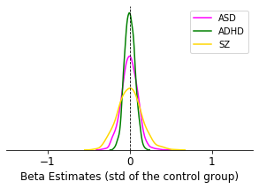
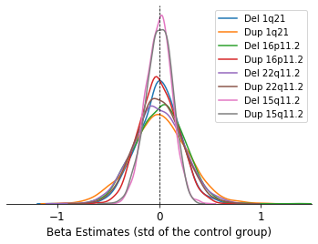
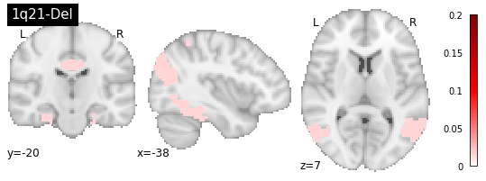
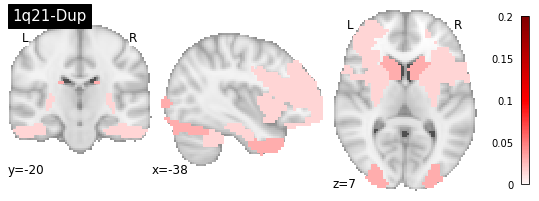
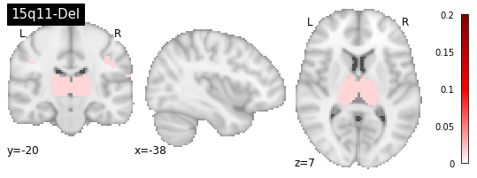
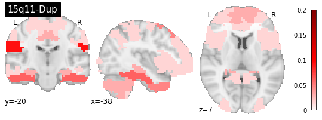
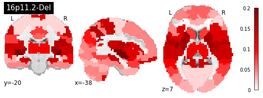
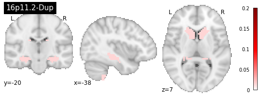
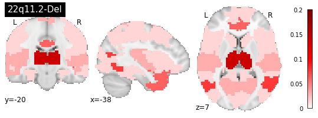
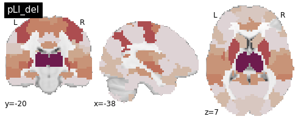

#### Clara Moreau and Sebastian Urchs, March 2020
##### Contact: clara.moreau@umontreal.ca , sebastian.urchs@mail.mcgill.ca 


```python
%matplotlib inline
```


```python
import sys
sys.path.append('../../../')

import cnvfc
import numpy as np
import pandas as pd
import pathlib as pal
import seaborn as sbn
import scipy as sp
import nibabel as nib
from matplotlib import gridspec
import matplotlib.patches as mpatches
from matplotlib import pyplot as plt
from statsmodels.sandbox.stats.multicomp import multipletests as stm
```


```python
mist_64_p = '/data/cisl/ATLAS/MIST/Parcellations/MIST_64.nii.gz'
labels_p = '/data/cisl/ATLAS/MIST/Parcel_Information/MIST_64.csv'
labels12_p = '/data/cisl/ATLAS/MIST/Parcel_Information/MIST_12.csv'
hier_p = '/data/cisl/ATLAS/MIST/Hierarchy/MIST_PARCEL_ORDER.csv'


labels = pd.read_csv(labels_p, sep=';')
label12 = pd.read_csv(labels12_p, delimiter=';')
hier = pd.read_csv(hier_p)

s64_s12_parent_rois = [hier.iloc[hier[hier.s64==roi].s64.index.min()]['s12'] 
                       for roi in labels.roi.values]
s64_s12_parent_names = [label12[label12.roi==parent]['name'].values[0] for parent in s64_s12_parent_rois]

mist64_i = nib.load(mist_64_p)
mist64 = mist64_i.get_data()
```

### Load CNV FC-profiles


```python
root_p = pal.Path('../../../data/processed/fc_profiles_publication/').resolve()

out_p = pal.Path('../../../figures_publication').resolve()

if not out_p.is_dir():
    out_p.mkdir()

out_p_table = pal.Path('../../../data/tables_publication').resolve()
if not out_p_table.is_dir():
    out_p_table.mkdir()
```


```python
#1q
del1q_v_con_p = root_p / 'cnv_ukbb_del1q_vs_con_mean.tsv'
dc1q = pd.read_csv(del1q_v_con_p, sep='\t')

dup1q_v_con_p = root_p / 'cnv_ukbb_dup1q_vs_con_mean.tsv'
dp1q = pd.read_csv(dup1q_v_con_p, sep='\t')

dup1qTAR_v_con_p = root_p / 'cnv_ukbb_dup1qTAR_vs_con_mean.tsv'
dp1qTAR = pd.read_csv(dup1qTAR_v_con_p, sep='\t')

#2q
del2q13_v_con_p = root_p / 'cnv_ukbb_del2q13_vs_con_mean.tsv'
dc2q13 = pd.read_csv(del2q13_v_con_p, sep='\t')

dup2q13_v_con_p = root_p / 'cnv_ukbb_dup2q13_vs_con_mean.tsv'
dp2q13 = pd.read_csv(dup2q13_v_con_p, sep='\t')

#15q
del15q_v_con_p = root_p / 'cnv_ukbb_del15q_vs_con_mean.tsv'
dc15q = pd.read_csv(del15q_v_con_p, sep='\t')

dup15q_v_con_p = root_p / 'cnv_ukbb_dup15q_vs_con_mean.tsv'
dp15q = pd.read_csv(dup15q_v_con_p, sep='\t')

dup15q13_v_con_p = root_p / 'cnv_ukbb_dup15q13_vs_con_mean.tsv'
dp15q13 = pd.read_csv(dup15q13_v_con_p, sep='\t')

#16p
del16p_v_con_p = root_p / 'cnv_ukbb_del16p_vs_con_mean.tsv'
dc16pAll = pd.read_csv(del16p_v_con_p, sep='\t')

dup16p_v_con_p = root_p / 'cnv_ukbb_dup16p_vs_con_mean.tsv'
dp16pAll = pd.read_csv(dup16p_v_con_p, sep='\t')

#22q
del22q_v_con_p = root_p / 'cnv_ukbb_del22q_vs_con_mean.tsv'
dc22qAll = pd.read_csv(del22q_v_con_p, sep='\t')

dup22q_v_con_p = root_p / 'cnv_ukbb_dup22q_vs_con_mean.tsv'
dp22qAll = pd.read_csv(dup22q_v_con_p, sep='\t')

```

### Load IPC FC-profiles


```python
asd_v_con_p = root_p / 'cnv_ukbb_asd_vs_con_mean.tsv'
asd = pd.read_csv(asd_v_con_p, sep='\t')

adhd_v_con_p = root_p / 'cnv_ukbb_adhd_vs_con_mean.tsv'
adhd = pd.read_csv(adhd_v_con_p, sep='\t')

sz_v_con_p = root_p / 'cnv_ukbb_sz_vs_con_mean.tsv'
sz = pd.read_csv(sz_v_con_p, sep='\t')
```

### Load pLI FC-profiles


```python
pLIdel_all_p = root_p / 'icc_ukbb_pLIdel_mc.tsv'
pLIdel_all=pd.read_csv(pLIdel_all_p, sep='\t')

pLIdup_all_p = root_p / 'icc_ukbb_pLIdup_mc.tsv'
pLIdup_all=pd.read_csv(pLIdup_all_p, sep='\t')
```

### Results per CWAS


```python
cnv=dc22qAll # to edit
```


```python
eff_cnv_test = cnv.loc[cnv.qval<0.05, ['stand_betas']].values
n_hits = len(eff_cnv_test)
eff_pos = eff_cnv_test[eff_cnv_test>0]
n_pos = len(eff_pos)
eff_neg = eff_cnv_test[eff_cnv_test<0]
n_neg = len(eff_neg)
mean_cnv = np.mean(cnv.stand_betas)
var_cnv = np.var(cnv.stand_betas)
min_cnv = np.min(cnv.stand_betas)
max_cnv = np.max(cnv.stand_betas)

print(' They have a number of n={:.0f} altered connections '
      '\n (n_pos={:.0f}) (n_neg={:.0f}) with '
      '\n a variance={:.2f} (min={:.3f} max={:.3f})'.format(n_hits, n_pos, n_neg,
                                                    var_cnv, min_cnv, max_cnv))
```

     They have a number of n=46 altered connections 
     (n_pos=25) (n_neg=21) with 
     a variance=0.06 (min=-0.947 max=0.770)


### Regional findings


```python
conn_mask = np.tril(np.ones((64, 64))).astype(bool)
cnv_p_mat = cnvfc.tools.conn2mat(cnv.qval.values, conn_mask)
cnv_perc_disc = np.array([sum(cnv_p_mat[:, i]<0.05)/64 for i in range(64)])
cnv_order = np.argsort(cnv_perc_disc)[::-1]
cnv_table = pd.DataFrame(data={'region_rank': np.arange(1,65),
                               'region_name': list(labels.iloc[cnv_order]['name'].values),
                               'region_label': list(labels.iloc[cnv_order]['label'].values),
                               'n_connections_affected': (cnv_perc_disc[cnv_order] * 64).astype(int),
                               'percent_discovery': cnv_perc_disc[cnv_order]})
cnv_table[:8]
```


<div>
<style scoped>
    .dataframe tbody tr th:only-of-type {
        vertical-align: middle;
    }

    .dataframe tbody tr th {
        vertical-align: top;
    }

    .dataframe thead th {
        text-align: right;
    }
</style>
<table border="1" class="dataframe">
  <thead>
    <tr style="text-align: right;">
      <th></th>
      <th>region_rank</th>
      <th>region_name</th>
      <th>region_label</th>
      <th>n_connections_affected</th>
      <th>percent_discovery</th>
    </tr>
  </thead>
  <tbody>
    <tr>
      <td>0</td>
      <td>1</td>
      <td>THALAMUS</td>
      <td>THAL</td>
      <td>9</td>
      <td>0.140625</td>
    </tr>
    <tr>
      <td>1</td>
      <td>2</td>
      <td>ANTERIOR_CINGULATE_CORTEX_dorsal</td>
      <td>ACcor_d</td>
      <td>8</td>
      <td>0.125000</td>
    </tr>
    <tr>
      <td>2</td>
      <td>3</td>
      <td>FUSIFORM_GYRUS_lateral</td>
      <td>FUSgyr_l</td>
      <td>5</td>
      <td>0.078125</td>
    </tr>
    <tr>
      <td>3</td>
      <td>4</td>
      <td>POSTERIOR_CINGULATE_CORTEX_dorsal</td>
      <td>PCcor_d</td>
      <td>4</td>
      <td>0.062500</td>
    </tr>
    <tr>
      <td>4</td>
      <td>5</td>
      <td>TEMPORAL_POLE</td>
      <td>TP</td>
      <td>4</td>
      <td>0.062500</td>
    </tr>
    <tr>
      <td>5</td>
      <td>6</td>
      <td>ANTERIOR_INSULA_ventral_and_PERI_INSULAR_SULCUS</td>
      <td>AINS_v_PIsul</td>
      <td>4</td>
      <td>0.062500</td>
    </tr>
    <tr>
      <td>6</td>
      <td>7</td>
      <td>PERIGENUAL_ANTERIOR_CINGULATE_CORTEX</td>
      <td>PGACcor</td>
      <td>4</td>
      <td>0.062500</td>
    </tr>
    <tr>
      <td>7</td>
      <td>8</td>
      <td>CAUDATE_NUCLEUS_HEAD_and_NUCLEUS_ACCUMBENS</td>
      <td>CAUDNH_NACC</td>
      <td>4</td>
      <td>0.062500</td>
    </tr>
  </tbody>
</table>
</div>


```python
palette = sbn.color_palette()
color_list = list(palette.as_hex()[:7])

f = plt.figure(figsize=(5,3))
ax = f.add_subplot(111)
plt.xlim(-1.5, 1.5)


sbn.distplot(asd.stand_betas, hist=False, ax=ax, label="ASD", color="magenta") # Blue
sbn.distplot(adhd.stand_betas, hist=False, ax=ax, label="ADHD", color="green") # Orange
sbn.distplot(sz.stand_betas, hist=False, ax=ax, label="SZ", color="gold") # Green


ax.spines['top'].set_visible(False)
ax.spines['left'].set_visible(False)
ax.spines['right'].set_visible(False)
ax.set_yticks([]);
ax.set_xticks([-1, 0, 1]);
ax.set_xlabel('Beta Estimates (std of the control group)', fontsize=12);
ax.tick_params(axis="x", labelsize=12)

plt.axvline(0, color="k", linestyle="--", linewidth=0.8)

f.savefig(out_p / 'Dist_idiop_mC.png', dpi=500)
```





```python
palette = sbn.color_palette()
color_list = list(palette.as_hex()[:7])

f = plt.figure(figsize=(6,4))
ax = f.add_subplot(111)
plt.xlim(-1.5, 1.5)

sbn.distplot(dc1q.stand_betas, hist=False, ax=ax, label="Del 1q21") 
sbn.distplot(dp1q.stand_betas, hist=False, ax=ax, label="Dup 1q21") 
#sbn.distplot(dp1qTAR.stand_betas, hist=False, ax=ax, kde_kws={'linestyle':'--'}, label="DupTAR1q21") 

sbn.distplot(dc16pAll.stand_betas, hist=False, ax=ax, label="Del 16p11.2") 
sbn.distplot(dp16pAll.stand_betas, hist=False, ax=ax, label="Dup 16p11.2") 

sbn.distplot(dc22qAll.stand_betas, hist=False, ax=ax, label="Del 22q11.2") 
sbn.distplot(dp22qAll.stand_betas, hist=False, ax=ax, label="Dup 22q11.2") 

sbn.distplot(dc15q.stand_betas, hist=False, ax=ax, label="Del 15q11.2") 
sbn.distplot(dp15q.stand_betas, hist=False, ax=ax, label="Dup 15q11.2") 


ax.spines['top'].set_visible(False)
ax.spines['left'].set_visible(False)
ax.spines['right'].set_visible(False)
ax.set_yticks([]);
ax.set_xticks([-1, 0, 1]);
ax.set_xlabel('Beta Estimates (std of the control group)', fontsize=12);
ax.tick_params(axis="x", labelsize=12)

plt.axvline(0, color="k", linestyle="--", linewidth=0.8)
f.savefig(out_p / 'Dist_CNVall_mC.png', dpi=500)
```





## Sorting of regions based on percent of significant alerated connections


```python
conn_mask = np.tril(np.ones((64, 64))).astype(bool)
```

#### load q-values


```python
asd_p_mat = cnvfc.tools.conn2mat(asd.qval.values, conn_mask)
sz_p_mat = cnvfc.tools.conn2mat(sz.qval.values, conn_mask)
adhd_p_mat = cnvfc.tools.conn2mat(adhd.qval.values, conn_mask)

dc16pAll_p_mat = cnvfc.tools.conn2mat(dc16pAll.qval.values, conn_mask)
dp16pAll_p_mat = cnvfc.tools.conn2mat(dp16pAll.qval.values, conn_mask)

dc22qAll_p_mat = cnvfc.tools.conn2mat(dc22qAll.qval.values, conn_mask)
dp22qAll_p_mat = cnvfc.tools.conn2mat(dp22qAll.qval.values, conn_mask)

dc1q_p_mat = cnvfc.tools.conn2mat(dc1q.qval.values, conn_mask)
dp1q_p_mat = cnvfc.tools.conn2mat(dp1q.qval.values, conn_mask)

dc15q_p_mat = cnvfc.tools.conn2mat(dc15q.qval.values, conn_mask)
dp15q_p_mat = cnvfc.tools.conn2mat(dp15q.qval.values, conn_mask)

dp2q13_p_mat = cnvfc.tools.conn2mat(dp2q13.qval.values, conn_mask)

plidel_p_mat = cnvfc.tools.conn2mat(pLIdel_all.qval.values, conn_mask)
plidup_p_mat = cnvfc.tools.conn2mat(pLIdup_all.qval.values, conn_mask)
```

#### compute percentage of discovery (64 seed-based regions)


```python
asd_perc_disc = np.array([sum(asd_p_mat[:, i]<0.05)/64 for i in range(64)])
sz_perc_disc = np.array([sum(sz_p_mat[:, i]<0.05)/64 for i in range(64)])
adhd_perc_disc = np.array([sum(adhd_p_mat[:, i]<0.05)/64 for i in range(64)])

dc16pAll_perc_disc = np.array([sum(dc16pAll_p_mat[:, i]<0.05)/64 for i in range(64)])
dp16pAll_perc_disc = np.array([sum(dp16pAll_p_mat[:, i]<0.05)/64 for i in range(64)])

dc22qAll_perc_disc = np.array([sum(dc22qAll_p_mat[:, i]<0.05)/64 for i in range(64)])
dp22qAll_perc_disc = np.array([sum(dp22qAll_p_mat[:, i]<0.05)/64 for i in range(64)])

dc1q_perc_disc = np.array([sum(dc1q_p_mat[:, i]<0.05)/64 for i in range(64)])
dp1q_perc_disc = np.array([sum(dp1q_p_mat[:, i]<0.05)/64 for i in range(64)])

dc15q_perc_disc = np.array([sum(dc15q_p_mat[:, i]<0.05)/64 for i in range(64)])
dp15q_perc_disc = np.array([sum(dp15q_p_mat[:, i]<0.05)/64 for i in range(64)])

dp2q13_perc_disc = np.array([sum(dp2q13_p_mat[:, i]<0.05)/64 for i in range(64)])

plidel_perc_disc = np.array([sum(plidel_p_mat[:, i]<0.05)/64 for i in range(64)])
plidup_perc_disc = np.array([sum(plidup_p_mat[:, i]<0.05)/64 for i in range(64)])
```

#### sort Region per number of percentage of discovery


```python
dc16pAll_order = np.argsort(dc16pAll_perc_disc)[::-1]
dp16pAll_order = np.argsort(dp16pAll_perc_disc)[::-1]

dc22qAll_order = np.argsort(dc22qAll_perc_disc)[::-1]
dp22qAll_order = np.argsort(dp22qAll_perc_disc)[::-1]

dc1q_order = np.argsort(dc1q_perc_disc)[::-1]
dp1q_order = np.argsort(dp1q_perc_disc)[::-1]

dc15q_order = np.argsort(dc15q_perc_disc)[::-1]
dp15q_order = np.argsort(dp15q_perc_disc)[::-1]

asd_order = np.argsort(asd_perc_disc)[::-1]
sz_order = np.argsort(sz_perc_disc)[::-1]
adhd_order = np.argsort(adhd_perc_disc)[::-1]

dp2q13_order = np.argsort(dp2q13_perc_disc)[::-1]

plidel_order = np.argsort(plidel_perc_disc)[::-1]
plidup_order = np.argsort(plidup_perc_disc)[::-1]
```

#### generate summary tables


```python
dc16pAll_table = pd.DataFrame(data={'region_rank': np.arange(1,65),
                               'region_name': list(labels.iloc[dc16pAll_order]['name'].values),
                               'region_label': list(labels.iloc[dc16pAll_order]['label'].values),
                               'n_connections_affected': (dc16pAll_perc_disc[dc16pAll_order] * 64).astype(int),
                               'percent_discovery': dc16pAll_perc_disc[dc16pAll_order]})

dp16pAll_table = pd.DataFrame(data={'region_rank': np.arange(1,65),
                               'region_name': list(labels.iloc[dp16pAll_order]['name'].values),
                               'region_label': list(labels.iloc[dp16pAll_order]['label'].values),
                               'n_connections_affected': (dp16pAll_perc_disc[dp16pAll_order] * 64).astype(int),
                               'percent_discovery': dp16pAll_perc_disc[dp16pAll_order]})

dc22qAll_table = pd.DataFrame(data={'region_rank': np.arange(1,65),
                               'region_name': list(labels.iloc[dc22qAll_order]['name'].values),
                               'region_label': list(labels.iloc[dc22qAll_order]['label'].values),
                               'n_connections_affected': (dc22qAll_perc_disc[dc22qAll_order] * 64).astype(int),
                               'percent_discovery': dc22qAll_perc_disc[dc22qAll_order]})

dp22qAll_table = pd.DataFrame(data={'region_rank': np.arange(1,65),
                               'region_name': list(labels.iloc[dp22qAll_order]['name'].values),
                               'region_label': list(labels.iloc[dp22qAll_order]['label'].values),
                               'n_connections_affected': (dp22qAll_perc_disc[dp22qAll_order] * 64).astype(int),
                               'percent_discovery': dp22qAll_perc_disc[dp22qAll_order]})

dc1q_table = pd.DataFrame(data={'region_rank': np.arange(1,65),
                               'region_name': list(labels.iloc[dc1q_order]['name'].values),
                               'region_label': list(labels.iloc[dc1q_order]['label'].values),
                               'n_connections_affected': (dc1q_perc_disc[dc1q_order] * 64).astype(int),
                               'percent_discovery': dc1q_perc_disc[dc1q_order]})

dp1q_table = pd.DataFrame(data={'region_rank': np.arange(1,65),
                               'region_name': list(labels.iloc[dp1q_order]['name'].values),
                               'region_label': list(labels.iloc[dp1q_order]['label'].values),
                               'n_connections_affected': (dp1q_perc_disc[dp1q_order] * 64).astype(int),
                               'percent_discovery': dp1q_perc_disc[dp1q_order]})

dc15q_table = pd.DataFrame(data={'region_rank': np.arange(1,65),
                               'region_name': list(labels.iloc[dc15q_order]['name'].values),
                               'region_label': list(labels.iloc[dc15q_order]['label'].values),
                               'n_connections_affected': (dc15q_perc_disc[dc15q_order] * 64).astype(int),
                               'percent_discovery': dc15q_perc_disc[dc15q_order]})

dp15q_table = pd.DataFrame(data={'region_rank': np.arange(1,65),
                               'region_name': list(labels.iloc[dp15q_order]['name'].values),
                               'region_label': list(labels.iloc[dp15q_order]['label'].values),
                               'n_connections_affected': (dp15q_perc_disc[dp15q_order] * 64).astype(int),
                               'percent_discovery': dp15q_perc_disc[dp15q_order]})

dp2q13_table = pd.DataFrame(data={'region_rank': np.arange(1,65),
                               'region_name': list(labels.iloc[dp2q13_order]['name'].values),
                               'region_label': list(labels.iloc[dp2q13_order]['label'].values),
                               'n_connections_affected': (dp2q13_perc_disc[dp2q13_order] * 64).astype(int),
                               'percent_discovery': dp2q13_perc_disc[dp2q13_order]})

asd_table = pd.DataFrame(data={'region_rank': np.arange(1,65),
                               'region_name': list(labels.iloc[asd_order]['name'].values),
                               'region_label': list(labels.iloc[asd_order]['label'].values),
                               'n_connections_affected': (asd_perc_disc[asd_order] * 64).astype(int),
                               'percent_discovery': asd_perc_disc[asd_order]})

sz_table = pd.DataFrame(data={'region_rank': np.arange(1,65),
                               'region_name': list(labels.iloc[sz_order]['name'].values),
                               'region_label': list(labels.iloc[sz_order]['label'].values),
                               'n_connections_affected': (sz_perc_disc[sz_order] * 64).astype(int),
                               'percent_discovery': sz_perc_disc[sz_order]})

adhd_table = pd.DataFrame(data={'region_rank': np.arange(1,65),
                               'region_name': list(labels.iloc[adhd_order]['name'].values),
                               'region_label': list(labels.iloc[adhd_order]['label'].values),
                               'n_connections_affected': (adhd_perc_disc[adhd_order] * 64).astype(int),
                               'percent_discovery': adhd_perc_disc[adhd_order]})

plidel_table = pd.DataFrame(data={'region_rank': np.arange(1,65),
                               'region_name': list(labels.iloc[plidel_order]['name'].values),
                               'region_label': list(labels.iloc[plidel_order]['label'].values),
                               'n_connections_affected': (plidel_perc_disc[plidel_order] * 64).astype(int),
                               'percent_discovery': plidel_perc_disc[plidel_order]})

plidup_table = pd.DataFrame(data={'region_rank': np.arange(1,65),
                               'region_name': list(labels.iloc[plidup_order]['name'].values),
                               'region_label': list(labels.iloc[plidup_order]['label'].values),
                               'n_connections_affected': (plidup_perc_disc[plidup_order] * 64).astype(int),
                               'percent_discovery': plidup_perc_disc[plidup_order]})
```


```python
plidel_table[:10] 
```


<div>
<style scoped>
    .dataframe tbody tr th:only-of-type {
        vertical-align: middle;
    }

    .dataframe tbody tr th {
        vertical-align: top;
    }

    .dataframe thead th {
        text-align: right;
    }
</style>
<table border="1" class="dataframe">
  <thead>
    <tr style="text-align: right;">
      <th></th>
      <th>region_rank</th>
      <th>region_name</th>
      <th>region_label</th>
      <th>n_connections_affected</th>
      <th>percent_discovery</th>
    </tr>
  </thead>
  <tbody>
    <tr>
      <td>0</td>
      <td>1</td>
      <td>ANTERIOR_CINGULATE_CORTEX_dorsal</td>
      <td>ACcor_d</td>
      <td>17</td>
      <td>0.265625</td>
    </tr>
    <tr>
      <td>1</td>
      <td>2</td>
      <td>THALAMUS</td>
      <td>THAL</td>
      <td>13</td>
      <td>0.203125</td>
    </tr>
    <tr>
      <td>2</td>
      <td>3</td>
      <td>PRE_SUPPLEMENTARY_MOTOR_CORTEX</td>
      <td>SMOTcor</td>
      <td>11</td>
      <td>0.171875</td>
    </tr>
    <tr>
      <td>3</td>
      <td>4</td>
      <td>DORSOMEDIAL_PREFRONTAL_CORTEX_posterior</td>
      <td>DMPFcor_p</td>
      <td>11</td>
      <td>0.171875</td>
    </tr>
    <tr>
      <td>4</td>
      <td>5</td>
      <td>PUTAMEN</td>
      <td>PUT</td>
      <td>9</td>
      <td>0.140625</td>
    </tr>
    <tr>
      <td>5</td>
      <td>6</td>
      <td>left_INFERIOR_PARIETAL_LOBULE</td>
      <td>L_IPlob</td>
      <td>9</td>
      <td>0.140625</td>
    </tr>
    <tr>
      <td>6</td>
      <td>7</td>
      <td>SOMATOMOTOR_NETWORK_dorsolateral</td>
      <td>MOTnet_dl</td>
      <td>9</td>
      <td>0.140625</td>
    </tr>
    <tr>
      <td>7</td>
      <td>8</td>
      <td>right_INFERIOR_PARIETAL_LOBULE</td>
      <td>R_IPlob</td>
      <td>8</td>
      <td>0.125000</td>
    </tr>
    <tr>
      <td>8</td>
      <td>9</td>
      <td>POSTERIOR_INSULA_ventral</td>
      <td>PINS_v</td>
      <td>7</td>
      <td>0.109375</td>
    </tr>
    <tr>
      <td>9</td>
      <td>10</td>
      <td>VENTRAL_MEDIAL_PREFRONTAL_CORTEX</td>
      <td>VMPFcor</td>
      <td>7</td>
      <td>0.109375</td>
    </tr>
  </tbody>
</table>
</div>


#### save results


```python
dc16pAll_table.to_csv(out_p_table / 'dc16pAll_table_mc.tsv', sep='\t', index=False)
dp16pAll_table.to_csv(out_p_table / 'dp16pAll_table_mc.tsv', sep='\t', index=False)

dc22qAll_table.to_csv(out_p_table / 'dc22qAll_table_mc.tsv', sep='\t', index=False)
dp22qAll_table.to_csv(out_p_table / 'dp22qAll_table_mc.tsv', sep='\t', index=False)

dc1q_table.to_csv(out_p_table / 'dc1q_table_mc.tsv', sep='\t', index=False)
dp1q_table.to_csv(out_p_table / 'dp1q_table_mc.tsv', sep='\t', index=False)

dp2q13_table.to_csv(out_p_table / 'dp2q13_table_mc.tsv', sep='\t', index=False)

dc15q_table.to_csv(out_p_table / 'dc15q_table_mc.tsv', sep='\t', index=False)
dp15q_table.to_csv(out_p_table / 'dp15q_table_mc.tsv', sep='\t', index=False)

asd_table.to_csv(out_p_table / 'asd_table_mc.tsv', sep='\t', index=False)
sz_table.to_csv(out_p_table / 'sz_table_mc.tsv', sep='\t', index=False)
adhd_table.to_csv(out_p_table / 'adhd_table_mc.tsv', sep='\t', index=False)

plidel_table.to_csv(out_p_table / 'plidel_table_mc.tsv', sep='\t', index=False)
plidup_table.to_csv(out_p_table / 'plidup_table_mc.tsv', sep='\t', index=False)
```

## Plots the percentage of significant alterations into a brain


```python
from nilearn import input_data as nii
from nilearn import plotting as nlp
from nilearn import datasets
from nilearn import surface
```

#### prepare the data


```python
mask = mist64_i.get_data().astype(bool)
mask_i = nib.Nifti1Image(mask, affine=mist64_i.affine, header=mist64_i.header)
masker = nii.NiftiMasker(mask_img=mask_i, standardize=False)
masker.fit()
atlas_vec = masker.fit_transform(mist64_i).squeeze() - 1

d = {'Del16pAll': dc16pAll_perc_disc, 
     'Dup16pAll': dp16pAll_perc_disc,
     'Del22qAll': dc22qAll_perc_disc, 
     'Dup22qAll': dp22qAll_perc_disc,
     'Del1q': dc1q_perc_disc, 
     'Dup1q': dp1q_perc_disc,
     'Dup2q': dp2q13_perc_disc,
     'Del15q': dc15q_perc_disc, 
     'Dup15q': dp15q_perc_disc,
     'pLIdel': plidel_perc_disc, 
     'pLIdup': plidup_perc_disc,
     'asd' : asd_perc_disc,
     'sz' : sz_perc_disc,
     'adhd' : adhd_perc_disc}

data = pd.DataFrame(data=d)

del16pAll_brain_vec = data.Del16pAll[atlas_vec]
del16pAll_brain_img = masker.inverse_transform(del16pAll_brain_vec)

dup16pAll_brain_vec = data.Dup16pAll[atlas_vec]
dup16pAll_brain_img = masker.inverse_transform(dup16pAll_brain_vec)

del22qAll_brain_vec = data.Del22qAll[atlas_vec]
del22qAll_brain_img = masker.inverse_transform(del22qAll_brain_vec)

dup22qAll_brain_vec = data.Dup22qAll[atlas_vec]
dup22qAll_brain_img = masker.inverse_transform(dup22qAll_brain_vec)

del1q_brain_vec = data.Del1q[atlas_vec]
del1q_brain_img = masker.inverse_transform(del1q_brain_vec)

dup1q_brain_vec = data.Dup1q[atlas_vec]
dup1q_brain_img = masker.inverse_transform(dup1q_brain_vec)

dup2q_brain_vec = data.Dup2q[atlas_vec]
dup2q_brain_img = masker.inverse_transform(dup2q_brain_vec)

del15q_brain_vec = data.Del15q[atlas_vec]
del15q_brain_img = masker.inverse_transform(del15q_brain_vec)

dup15q_brain_vec = data.Dup15q[atlas_vec]
dup15q_brain_img = masker.inverse_transform(dup15q_brain_vec)

asd_brain_vec = data.asd[atlas_vec]
asd_brain_img = masker.inverse_transform(asd_brain_vec)

sz_brain_vec = data.sz[atlas_vec]
sz_brain_img = masker.inverse_transform(sz_brain_vec)

adhd_brain_vec = data.adhd[atlas_vec]
adhd_brain_img = masker.inverse_transform(adhd_brain_vec)

plidel_brain_vec = data.pLIdel[atlas_vec]
plidel_brain_img = masker.inverse_transform(plidel_brain_vec)

plidup_brain_vec = data.pLIdup[atlas_vec]
plidup_brain_img = masker.inverse_transform(plidup_brain_vec)
```

#### generate the map


```python
cuts = (-38, -20, 7)
vmax=0.2
```


```python
dc1q_map=nlp.plot_stat_map(del1q_brain_img, title='1q21-Del',  cut_coords=cuts,draw_cross=False,cmap=plt.cm.seismic, vmax=vmax, threshold=0)
dc1q_map.savefig(out_p / 'map_1qdel_mC.png', dpi=300)

dp1q_map=nlp.plot_stat_map(dup1q_brain_img, title='1q21-Dup',  cut_coords=cuts,draw_cross=False,cmap=plt.cm.seismic, vmax=vmax, threshold=0)
dp1q_map.savefig( out_p / 'map_1qdup_mC.png', dpi=300)

dc15q_map=nlp.plot_stat_map(del15q_brain_img, title='15q11-Del',  cut_coords=cuts,draw_cross=False,cmap=plt.cm.seismic, vmax=vmax, threshold=0)
dc15q_map.savefig(out_p /'map_15qdel_mC.png', dpi=300)

dp15q_map=nlp.plot_stat_map(dup15q_brain_img, title='15q11-Dup', cut_coords=cuts,  draw_cross=False,cmap=plt.cm.seismic, vmax=vmax, threshold=0)
dp15q_map.savefig(out_p / 'map_15qdup_mC.png', dpi=300)

dc16p_map=nlp.plot_stat_map(del16pAll_brain_img, title='16p11.2-Del',  cut_coords=cuts,draw_cross=False,cmap=plt.cm.seismic, vmax=vmax, threshold=0)
dc16p_map.savefig(out_p /'map_16pdel_mC.png', dpi=300)

dp16p_map=nlp.plot_stat_map(dup16pAll_brain_img, title='16p11.2-Dup', cut_coords=cuts, draw_cross=False,cmap=plt.cm.seismic, vmax=vmax, threshold=0)
dp16p_map.savefig(out_p /'map_16pdup_mC.png', dpi=300)

dc22q_map=nlp.plot_stat_map(del22qAll_brain_img, title='22q11.2-Del',  cut_coords=cuts,draw_cross=False,cmap=plt.cm.seismic, vmax=vmax, threshold=0)
dc22q_map.savefig( out_p /'map_22qdel_mC.png', dpi=300)
```























```python
plidel_map=nlp.plot_stat_map(plidel_brain_img,  title='pLI_del',  draw_cross=False,cut_coords=cuts,cmap=plt.cm.twilight_shifted, colorbar=False, threshold=0)
plidel_map.savefig(out_p / 'map_pli_del_mC.png', dpi=200)
```




